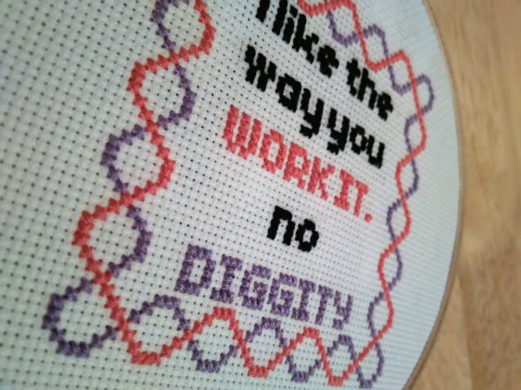

# DOM DIGGITY!

## DOM Manipulation and Game Logic

Let's make a game that changes the turns of the contestants!

In this exercise, we will:

- Build a model of our game
- Use a function to render our changes from the model to the DOM
- Use JQuery for dom manipulation
- Host our game using GH Pages

#### GH Pages

For this project, we'll be hosting our projects on GH Pages. All GH Pages have
the same pattern for urls:

`http://username.github.io/repo_name`

GitHub has beautiful documentation for setting up your project on
[GitHub Pages](https://pages.github.com/).
